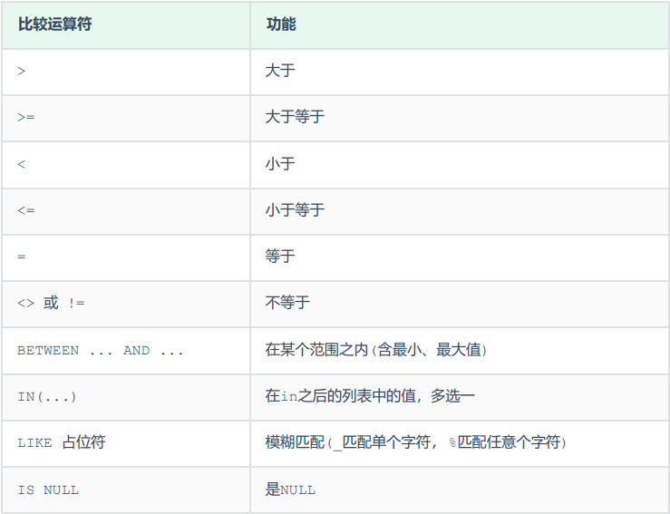
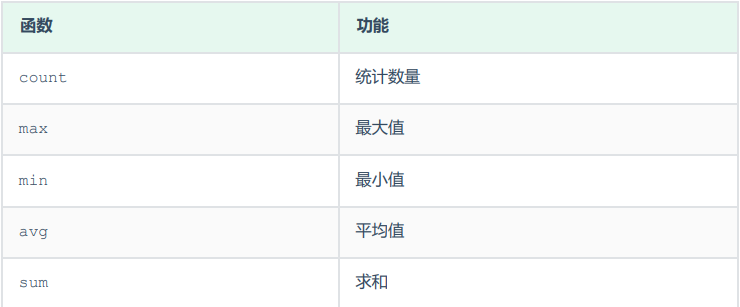

# 基本语法

## DDL

> ***Data Definition Language，数据定义语言，用来定义数据库、表、字段。***

---

### 数据库操作

#### 查询所有数据库

> - ***show databases;***

#### 查询当前数据库

> - ***select database();***

#### 创建数据库

> - ***create database [if not exists] 数据库名 [default charset 字符集] [collate 排序规则];***

#### 删除数据库

> - ***drop database [if exists] 数据库名;***

#### 使用数据库

> - ***use 数据库名;***
> - **tips:**
>   - `sys` 是系统数据库。

---

### 表操作

#### 查询当前数据库所有表

> - ***show tables;***

#### 查询表结构

> - ***desc 表名;***

#### 查询指定表的建表语句

> - ***show create table 表名;***

#### 创建表

> - ***create table 表名(字段1 字段1类型 [comment 字段1注释], 字段2 字段2类型 [comment 字段2注释], ..., 字段n 字段n类型 [comment 字段n注释]) [comment 表注释];***

#### 添加字段

> - ***alter table 表名 add 字段名 数据类型(长度) [comment 注释] [约束];***

#### 修改字段的数据类型

> - ***alter table 表名 modify 字段名 新数据类型(长度);***

#### 修改字段的名字和数据类型

> - ***alter table 表名 change 旧字段名 新字段名 新数据类型(长度) [comment 注释] [约束];***

#### 删除字段

> - ***alter table 表名 drop 字段名;***

#### 修改表名

> - ***alter table 表名 rename to 新表名;***

#### 删除表

> - ***drop table [if exists] 表名;***

#### 删除表并重新创建该表

> - ***truncate table 表名;***

---
---

## DML

> ***Data Manipulation Language，数据操作语言，用来对数据库表中的数据进行增加、删除和修改。***

---

### 添加数据

#### 给指定字段添加数据

> - ***insert into 表名 (字段名1, 字段名2, ...) values (值1, 值2, ...);***
> - ***tips:***
>   - 插入数据时，指定的字段顺序需要与值的顺序是一一对应的。
>   - 字符串和日期型数据应该包含在引号中。
>   - 插入的数据大小，应该在字段的规定范围内。

#### 给全部字段添加数据

> - ***insert into 表名 values (值1, 值2, ...);***

#### 批量添加数据

> - ***insert into 表名 (字段名1, 字段名2, ...) values (值1, 值2, ...), (值1, 值2, ...), (值1, 值2, ...), (值1, 值2, ...);***
> - ***insert into 表名 values (值1, 值2, ...), (值1, 值2, ...), (值1, 值2, ...), (值1, 值2, ...);***

---

### 根据where条件语句修改数据

> - ***update 表名 set 字段名1 = 值1, 字段名2 = 值2, ... [where 条件];***
> - ***tips:***
>   - 修改语句的条件可以有，也可以没有，如果没有条件，则会修改整张表的所有数据。

---

### 根据where条件语句删除数据

> - ***delete from 表名 [where 条件];***
> - ***tips:***
>   - `delete` 语句的条件可以有，也可以没有，如果没有条件，则会删除整张表的所有数据。
>   - `delete` 语句不能删除某一个字段的值，可以使用 `update` 语句将该字段值设置为空即可。

---
---

## DQL

> ***Data Query Language，数据查询语言，用来查询数据库表中的记录。***

---

### 查询语句规范

> - ***select 字段列表 from 表名列表 where 条件列表 group by 分组字段列表 having 分组后条件列表 order by 排序字段列表 limit 分页参数;***

---

### 基础查询

#### 查询多个字段

> - ***select 字段1, 字段2, ... from 表名;***
> - ***select * from 表名;***
> - ***tips:***
>   - 查询全部字段时不要使用通配符，要把字段全部写出来，因为前者效率低。

#### 字段设置别名

> - ***select 字段1 [as 别名1], 字段2 [as 别名2], ... from 表名;***
> - ***tips:***
>   - `as` 可以省略。

#### 查询时去除重复记录

> - ***select distinct 字段1, 字段2, ... from 表名;***

---

### 条件查询

#### 条件查询语句

> - ***select 字段列表 from 表名 where 条件列表;***
> - ***tips:***
>   - 注意不等号的两种写法。
>   - 对于同类型数据的 `and` 和 `or` 条件，优先使用 `between...and...` 和 `in(..., ...)` 语句，比如区间查询。
>   - `like` 后面是字符串，要在引号内写通配符。
>   - 注意为空和不为空分别是 `is null` 和 `is not null` 。

#### 常用比较运算符

> 

#### 常用逻辑运算符

> 

---

### 聚合函数

#### 聚合函数使用

> - ***select 聚合函数(字段列表) from 表名;***
> - ***tips:***
>   - 空值不参与所有聚合函数运算。

#### 常见聚合函数

> 

---

## DCL

***Data Control Language，数据控制语言，用来创建数据库用户以及控制数据库的访问权限。***
