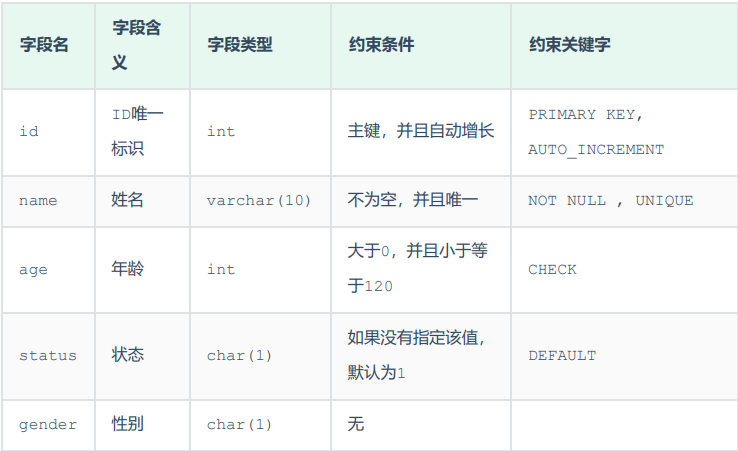

# SQL使用

## DDL

> ***Data Definition Language，数据定义语言，用来定义数据库、表、字段。***

---

### 数据库操作

#### 查询所有数据库

> - ***show databases;***

#### 查询当前数据库

> - ***select database();***

#### 创建数据库

> - ***create database [if not exists] 数据库名 [default charset 字符集] [collate 排序规则];***

#### 删除数据库

> - ***drop database [if exists] 数据库名;***

#### 使用数据库

> - ***use 数据库名;***
> - **tips:**
>   - `sys` 是系统数据库。

---

### 表操作

#### 查询当前数据库所有表

> - ***show tables;***

#### 查询表结构

> - ***desc 表名;***

#### 查询指定表的建表语句

> - ***show create table 表名;***

#### 创建表

> - ***create table 表名(字段1 字段1类型 [comment 字段1注释], 字段2 字段2类型 [comment 字段2注释], ..., 字段n 字段n类型 [comment 字段n注释]) [comment 表注释];***

#### 添加字段

> - ***alter table 表名 add 字段名 数据类型(长度) [comment 注释] [约束];***

#### 修改字段的数据类型

> - ***alter table 表名 modify 字段名 新数据类型(长度);***

#### 修改字段的名字和数据类型

> - ***alter table 表名 change 旧字段名 新字段名 新数据类型(长度) [comment 注释] [约束];***

#### 删除字段

> - ***alter table 表名 drop 字段名;***

#### 修改表名

> - ***alter table 表名 rename to 新表名;***

#### 删除表

> - ***drop table [if exists] 表名;***

#### 删除表并重新创建该表

> - ***truncate table 表名;***

---
---

## DML

> ***Data Manipulation Language，数据操作语言，用来对数据库表中的数据进行增加、删除和修改。***

---

### 添加数据

#### 给指定字段添加数据

> - ***insert into 表名 (字段名1, 字段名2, ...) values (值1, 值2, ...);***
> - ***tips:***
>   - 插入数据时，指定的字段顺序需要与值的顺序是一一对应的。
>   - 字符串和日期型数据应该包含在引号中。
>   - 插入的数据大小，应该在字段的规定范围内。

#### 给全部字段添加数据

> - ***insert into 表名 values (值1, 值2, ...);***

#### 批量添加数据

> - ***insert into 表名 (字段名1, 字段名2, ...) values (值1, 值2, ...), (值1, 值2, ...), (值1, 值2, ...), (值1, 值2, ...);***
> - ***insert into 表名 values (值1, 值2, ...), (值1, 值2, ...), (值1, 值2, ...), (值1, 值2, ...);***

---

### 修改数据

> - ***update 表名 set 字段名1 = 值1, 字段名2 = 值2, ... [where 条件];***
> - ***tips:***
>   - 修改语句的条件可以有，也可以没有，如果没有条件，则会修改整张表的所有数据。

---

### 删除数据

> - ***delete from 表名 [where 条件];***
> - ***tips:***
>   - `delete` 语句的条件可以有，也可以没有，如果没有条件，则会删除整张表的所有数据。
>   - `delete` 语句不能删除某一个字段的值，可以使用 `update` 语句将该字段值设置为空即可。

---
---

## DQL

> ***Data Query Language，数据查询语言，用来查询数据库表中的记录。***

---

### 基础查询

#### 查询多个字段

> - ***select 字段1, 字段2, ... from 表名;***
> - ***select * from 表名;***
> - ***tips:***
>   - 查询全部字段时不要使用通配符，要把字段全部写出来，因为前者效率低。

#### 字段或者表设置别名

> - ***select 字段1 [as 别名1], 字段2 [as 别名2], ... from 表名 [as 别名];***
> - ***tips:***
>   - `as` 可以省略。
>   - 字段在一个字句中设置别名后，后续的执行语句中可以使用别名而不是字段名。但注意执行顺序的影响，例如在 `select` 语句中命名的别名不能在 `where` 语句中使用。
>   - 如果表使用别名，各个关键字后面的字段都可以写成 `别名.字段名` 的形式，因为 `from` 语句最先执行。
>   - 一般会在 `select` 中给函数的执行结果起别名以便于将结果用于排序。

#### 查询时去除重复记录

> - ***select distinct 字段1, 字段2, ... from 表名;***

---

### 条件查询

> - ***select 字段列表 from 表名 where 条件列表;***
> - ***tips:***
>   - 注意不等号的两种写法。
>   - 对于同类型数据的 `and` 和 `or` 条件，优先使用 `between...and...` 和 `in(..., ...)` 语句，比如区间查询。
>   - `like` 后面是字符串，要在引号内写通配符。
>   - 注意为空和不为空分别是 `is null` 和 `is not null` 。

#### 常用比较运算符

> 

#### 常用逻辑运算符

> 

---

### 聚合函数

> - ***select 聚合函数(字段列表) from 表名;***
> - ***tips:***
>   - 空值不参与所有聚合函数运算。

#### 常见聚合函数

> 

---

### 分组查询

> - ***select 字段列表 from 表名 [where 条件] group by 分组字段名 [having 分组后过滤条件];***
> - ***tips:***
>   - `where` 和 `having` 的区别在于执行时机不同和判断条件不同。前者指 `where` 是分组之前进行过滤，不满足 `where` 条件不参与分组，而 `having` 是分组之后对结果进行过滤。后者指 `where` 不能对聚合函数进行判断，而 `having` 可以。
>   - 执行顺序为 `where` -> 聚合函数 -> `having`。
>   - 分组之后查询的字段一般为聚合函数和参与分组的字段，查询其他字段没有意义。

---

### 排序查询

> - ***select 字段列表 from 表名 order by 字段1 排序方式1, 字段2 排序方式2, ...;***
> - ***tips:***
>   - 排序方式包括默认的升序 `asc` （可省略）和降序 `desc` 。
>   - 多字段排序，当第一个字段值相同时，才会根据第二个字段进行排序。

---

### 分页查询

> - ***select 字段列表 from 表名 limit 起始索引, 查询记录数;***
> - ***tips:***
>   - 起始索引从 `0` 开始，`起始索引 = (查询页码 - 1) * 每页显示记录数`。
>   - 分页查询是数据库的方言，不同的数据库有不同的实现， `MySQL` 中是 `limit` 。
>   - 如果查询的是第一页数据，起始索引可以省略，直接简写为  `limit 10` 。

---

### DQL规范

#### 查询语句编写顺序

> - ***select 字段列表 from 表名列表 where 条件列表 group by 分组字段列表 having 分组后条件列表 order by 排序字段列表 limit 分页参数;***

#### 查询语句执行顺序

> - from 表名列表 -> where 条件列表 -> group by 分组字段列表 having 分组后条件列表 -> select 字段列表 -> order by 排序字段列表 -> limit 分页参数。

---
---

## DCL

> ***Data Control Language，数据控制语言，用来创建数据库用户以及控制数据库的访问权限。***

---

### 管理用户

#### 查询用户

> - ***use mysql;***
> - ***select * from user;***

#### 创建用户

> - ***create user '用户名'@'主机名' identified by '密码';***
> - ***tips:***
>   - 主机名可以使用 `%` 代表所有机器都可以访问。

#### 修改用户密码

> - ***alter user '用户名'@'主机名' identified with mysql_native_password by '新密码';***

#### 删除用户

> - ***drop user '用户名'@'主机名';***

---

### 权限控制

#### 常用权限

> 

#### 查询权限

> - ***show grants for '用户名'@'主机名';***

#### 授予权限

> - ***grant 权限列表 on 数据库名.表名 to '用户名'@'主机名';***
> - ***tips:***
>   - 多个权限之间，使用逗号分隔。
>   - 授权时，数据库名和表名可以使用 `*` 进行通配，代表所有，如 `数据库名.*` 表示某个数据库的所有表。
>   - 所有权限的权限列表可以用 `all` 来代替。

#### 撤销权限

> - ***remove 权限列表 on 数据库名.表名 from '用户名'@'主机名';***

---
---

## 函数

### 常用字符串函数

> 

#### 字符串拼接

> - ***select concat('Hello', ' MySQL');***

#### 全部转小写

> - ***select lower('Hello');***

#### 全部转大写

> - ***select upper('Hello');***

#### 左填充和右填充

> - ***select lpad('01', 5, '-');***
> - ***select rpad('01', 5, '-');***

#### 去除空格

> - ***select trim(' Hello MySQL ');***

#### 截取子串

> - ***select substring('Hello MySQL', 1, 5);***
> - ***tips:***
>   - 字符串索引从1开始。

---

### 常用数值函数

> 

#### 向上取整

> - ***select ceil(1.1);***

#### 向下取整

> - ***select floor(1.9);***

#### 取模

> - ***select mod(7, 4);***

#### 获取随机数

> - ***select rand();***

#### 四舍五入

> - ***select round(2.344, 2);***

#### 生成6位数随机验证码

> - ***select lpad(round(rand() * 1000000, 0), 6, '0');***

---

### 常用日期函数

> 

#### 获取当前日期

> - ***select curdate();***

#### 获取当前时间

> - ***select curtime();***

#### 获取当前日期和时间

> - ***select now();***

#### 获取当前年、月、日

> - ***select year(now());***
> - ***select month(now());***
> - ***select day(now());***

#### 增加指定的时间间隔

> - ***select date_add(now(), INTERVAL 70 YEAR);***

#### 获取两个日期相差的天数

> - ***select datediff('2023-10-01', '2023-12-01');***

#### 查询所有员工的入职天数，并根据入职天数倒序排序

> - ***select name, datediff(curdate(), entrydate) as 'entrydays' from emp order by entrydays desc;***

---

### 常用流程函数

> 

#### 判断学生各个科目的分数等级

> - ***select id, name, (case when math >= 85 then '优秀' when math >=60 then '及格' else '不及格' end) '数学', (case when english >= 85 then '优秀' when english >= 60 then '及格' else '不及格' end) '英语' , (case when chinese >= 85 then '优秀' when chinese >= 60 then '及格' else '不及格' end) '语文' from score;***

---
---

## 约束

### 常用约束

> 

#### 在创建表时为字段添加常用约束

> 
> 

---

### 外键约束

#### 添加外键

> - ***create table 表名(字段名 数据类型, ..., [constraint] [外键名称] foreign key (外键字段名) references 主表(主表列名));***
> - ***alter table 表名 add constraint 外键名 foreign key (外键字段名) references 主表(主表列名);***

#### 删除外键

> - ***alter table 表名 drop  foreign key 外键名;***

#### 添加外键以后删除或更新父表数据的约束行为

> 
