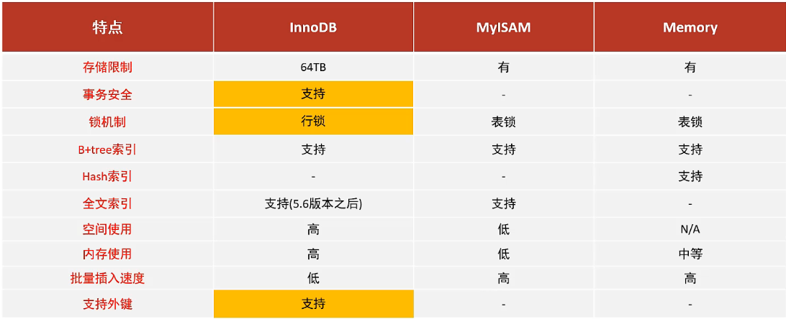

# MySQL存储引擎

## MySQL体系结构

> 
> 

---

## 指定和查询存储引擎

### 创建表时指定存储引擎

> - ***create table 表名(...) engine = 数据库名 comment = 注释;***

### 查询当前表使用的引擎

> - ***show create table 表名;***

### 查询当前数据库支持的存储引擎

> - ***show engines;***

---

## 三种存储引擎

### InnoDB

> - MySQL默认存储引擎，特点是事务、外键、行级锁。
> 

### MyISAM

> - MySQL早期的默认存储引擎，不支持事务、外键、行级锁，但支持表锁，访问速度快。

### Memory

> - Memory引擎的表数据是存储在内存中的，由于受到硬件问题、或断电问题的影响，只能将这些表作为临时表或缓存使用。

### 三种存储引擎的区别

> 

### 存储引擎的选择

> - InnoDB是Mysql的默认存储引擎，支持事务、外键。如果应用对事务的完整性有比较高的要求，在并发条件下要求数据的一致性，数据操作除了插入和查询之外，还包含很多的更新、删除操作，那么InnoDB存储引擎是比较合适的选择。
> - 对MyISAM来说，如果应用是以读操作和插入操作为主，只有很少的更新和删除操作，并且对事务的完整性、并发性要求不是很高，那么选择这个存储引擎是非常合适的。
> - 对MEMORY来说，将所有数据保存在内存中，访问速度快，通常用于临时表及缓存。MEMORY的缺陷就是对表的大小有限制，太大的表无法缓存在内存中，而且无法保障数据的安全性。

---
---
