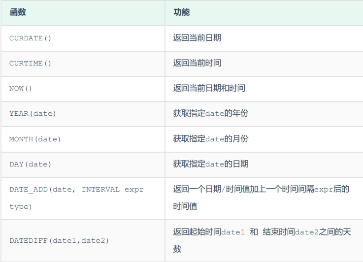
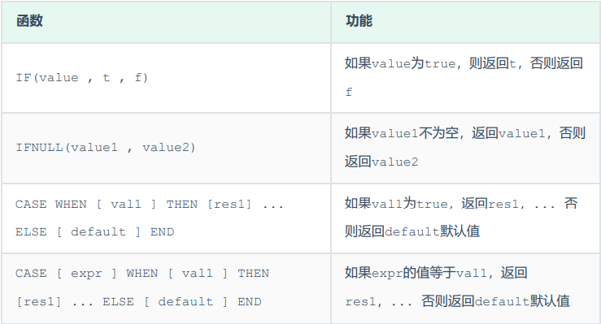
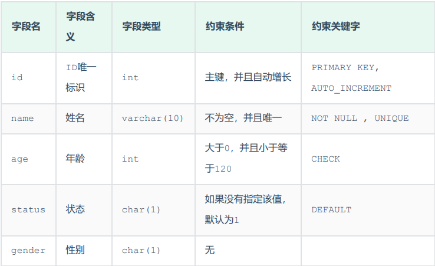

# SQL使用

## DDL

> ***Data Definition Language，数据定义语言，用来定义数据库、表、字段。***

---

### 数据库操作

#### 查询所有数据库

> - ***show databases;***

#### 查询当前数据库

> - ***select database();***

#### 创建数据库

> - ***create database [if not exists] 数据库名 [default charset 字符集] [collate 排序规则];***

#### 删除数据库

> - ***drop database [if exists] 数据库名;***

#### 使用数据库

> - ***use 数据库名;***
> - **tips:**
>   - `sys` 是系统数据库。

---

### 表操作

#### 查询当前数据库所有表

> - ***show tables;***

#### 查询表结构

> - ***desc 表名;***

#### 查询指定表的建表语句

> - ***show create table 表名;***

#### 创建表

> - ***create table 表名(字段1 字段1类型 [comment 字段1注释], 字段2 字段2类型 [comment 字段2注释], ..., 字段n 字段n类型 [comment 字段n注释]) [comment 表注释];***

#### 添加字段

> - ***alter table 表名 add 字段名 数据类型(长度) [comment 注释] [约束];***

#### 修改字段的数据类型

> - ***alter table 表名 modify 字段名 新数据类型(长度);***

#### 修改字段的名字和数据类型

> - ***alter table 表名 change 旧字段名 新字段名 新数据类型(长度) [comment 注释] [约束];***

#### 删除字段

> - ***alter table 表名 drop 字段名;***

#### 修改表名

> - ***alter table 表名 rename to 新表名;***

#### 删除表

> - ***drop table [if exists] 表名;***

#### 删除表并重新创建该表

> - ***truncate table 表名;***

---
---

## DML

> ***Data Manipulation Language，数据操作语言，用来对数据库表中的数据进行增加、删除和修改。***

---

### 添加数据

#### 给指定字段添加数据

> - ***insert into 表名 (字段名1, 字段名2, ...) values (值1, 值2, ...);***
> - ***tips:***
>   - 插入数据时，指定的字段顺序需要与值的顺序是一一对应的。
>   - 字符串和日期型数据应该包含在引号中。
>   - 插入的数据大小，应该在字段的规定范围内。

#### 给全部字段添加数据

> - ***insert into 表名 values (值1, 值2, ...);***

#### 批量添加数据

> - ***insert into 表名 (字段名1, 字段名2, ...) values (值1, 值2, ...), (值1, 值2, ...), (值1, 值2, ...), (值1, 值2, ...);***
> - ***insert into 表名 values (值1, 值2, ...), (值1, 值2, ...), (值1, 值2, ...), (值1, 值2, ...);***

---

### 修改数据

> - ***update 表名 set 字段名1 = 值1, 字段名2 = 值2, ... [where 条件];***
> - ***tips:***
>   - 修改语句的条件可以有，也可以没有，如果没有条件，则会修改整张表的所有数据。

---

### 删除数据

> - ***delete from 表名 [where 条件];***
> - ***tips:***
>   - `delete` 语句的条件可以有，也可以没有，如果没有条件，则会删除整张表的所有数据。
>   - `delete` 语句不能删除某一个字段的值，可以使用 `update` 语句将该字段值设置为空即可。

---
---

## DQL 单表查询

> ***Data Query Language，数据查询语言，用来查询数据库表中的记录。***

---

### 基础查询

#### 查询多个字段

> - ***select 字段1, 字段2, ... from 表名;***
> - ***select * from 表名;***
> - ***tips:***
>   - 查询全部字段时不要使用通配符，要把字段全部写出来，因为前者效率低。

#### 字段或者表设置别名

> - ***select 字段1 [as 别名1], 字段2 [as 别名2], ... from 表名 [as 别名];***
> - ***tips:***
>   - `as` 可以省略。
>   - 字段在一个字句中设置别名后，后续的执行语句中可以使用别名而不是字段名。但注意执行顺序的影响，例如在 `select` 语句中命名的别名不能在 `where` 语句中使用。
>   - 如果表使用别名，各个关键字后面的字段都可以写成 `别名.字段名` 的形式，因为 `from` 语句最先执行。
>   - 一般会在 `select` 中给函数的执行结果起别名以便于将结果用于排序。

#### 查询时去除重复记录

> - ***select distinct 字段1, 字段2, ... from 表名;***

---

### 条件查询

> - ***select 字段列表 from 表名 where 条件列表;***
> - ***tips:***
>   - 注意不等号的两种写法。
>   - 对于同类型数据的 `and` 和 `or` 条件，优先使用 `between...and...` 和 `in(..., ...)` 语句，比如区间查询。
>   - `like` 后面是字符串，要在引号内写通配符。
>   - 注意为空和不为空分别是 `is null` 和 `is not null` 。

#### 常用比较运算符

> 

#### 常用逻辑运算符

> 

---

### 聚合函数

> - ***select 聚合函数(字段列表) from 表名;***
> - ***tips:***
>   - 空值不参与所有聚合函数运算。

#### 常见聚合函数

> 

---

### 分组查询

> - ***select 字段列表 from 表名 [where 条件] group by 分组字段名 [having 分组后过滤条件];***
> - ***tips:***
>   - `where` 和 `having` 的区别在于执行时机不同和判断条件不同。前者指 `where` 是分组之前进行过滤，不满足 `where` 条件不参与分组，而 `having` 是分组之后对结果进行过滤。后者指 `where` 不能对聚合函数进行判断，而 `having` 可以。
>   - 执行顺序为 `where` -> 聚合函数 -> `having`。
>   - 分组之后查询的字段一般为聚合函数和参与分组的字段，查询其他字段没有意义。

---

### 排序查询

> - ***select 字段列表 from 表名 order by 字段1 排序方式1, 字段2 排序方式2, ...;***
> - ***tips:***
>   - 排序方式包括默认的升序 `asc` （可省略）和降序 `desc` 。
>   - 多字段排序，当第一个字段值相同时，才会根据第二个字段进行排序。

---

### 分页查询

> - ***select 字段列表 from 表名 limit 起始索引, 查询记录数;***
> - ***tips:***
>   - 起始索引从 `0` 开始，`起始索引 = (查询页码 - 1) * 每页显示记录数`。
>   - 分页查询是数据库的方言，不同的数据库有不同的实现， `MySQL` 中是 `limit` 。
>   - 如果查询的是第一页数据，起始索引可以省略，直接简写为  `limit 10` 。

---

### DQL规范

#### 查询语句编写顺序

> - ***select 字段列表 from 表名列表 where 条件列表 group by 分组字段列表 having 分组后条件列表 order by 排序字段列表 limit 分页参数;***

#### 查询语句执行顺序

> - from 表名列表 -> where 条件列表 -> group by 分组字段列表 having 分组后条件列表 -> select 字段列表 -> order by 排序字段列表 -> limit 分页参数。

---
---

## DCL

> ***Data Control Language，数据控制语言，用来创建数据库用户以及控制数据库的访问权限。***

---

### 管理用户

#### 查询用户

> - ***use mysql;***
> - ***select * from user;***

#### 创建用户

> - ***create user '用户名'@'主机名' identified by '密码';***
> - ***tips:***
>   - 主机名可以使用 `%` 代表所有机器都可以访问。

#### 修改用户密码

> - ***alter user '用户名'@'主机名' identified with mysql_native_password by '新密码';***

#### 删除用户

> - ***drop user '用户名'@'主机名';***

---

### 权限控制

#### 常用权限

> 

#### 查询权限

> - ***show grants for '用户名'@'主机名';***

#### 授予权限

> - ***grant 权限列表 on 数据库名.表名 to '用户名'@'主机名';***
> - ***tips:***
>   - 多个权限之间，使用逗号分隔。
>   - 授权时，数据库名和表名可以使用 `*` 进行通配，代表所有，如 `数据库名.*` 表示某个数据库的所有表。
>   - 所有权限的权限列表可以用 `all` 来代替。

#### 撤销权限

> - ***remove 权限列表 on 数据库名.表名 from '用户名'@'主机名';***

---
---

## 函数

### 常用字符串函数

> 

#### 字符串拼接

> - ***select concat('Hello', ' MySQL');***

#### 全部转小写

> - ***select lower('Hello');***

#### 全部转大写

> - ***select upper('Hello');***

#### 左填充和右填充

> - ***select lpad('01', 5, '-');***
> - ***select rpad('01', 5, '-');***

#### 去除空格

> - ***select trim(' Hello MySQL ');***

#### 截取子串

> - ***select substring('Hello MySQL', 1, 5);***
> - ***tips:***
>   - 字符串索引从1开始。

---

### 常用数值函数

> 

#### 向上取整

> - ***select ceil(1.1);***

#### 向下取整

> - ***select floor(1.9);***

#### 取模

> - ***select mod(7, 4);***

#### 获取随机数

> - ***select rand();***

#### 四舍五入

> - ***select round(2.344, 2);***

#### 生成6位数随机验证码

> - ***select lpad(round(rand() * 1000000, 0), 6, '0');***

---

### 常用日期函数

> 

#### 获取当前日期

> - ***select curdate();***

#### 获取当前时间

> - ***select curtime();***

#### 获取当前日期和时间

> - ***select now();***

#### 获取当前年、月、日

> - ***select year(now());***
> - ***select month(now());***
> - ***select day(now());***

#### 增加指定的时间间隔

> - ***select date_add(now(), INTERVAL 70 YEAR);***

#### 获取两个日期相差的天数

> - ***select datediff('2023-10-01', '2023-12-01');***

#### 查询所有员工的入职天数，并根据入职天数倒序排序

> - ***select name, datediff(curdate(), entrydate) as 'entrydays' from emp order by entrydays desc;***

---

### 常用流程函数

> 

#### 判断学生各个科目的分数等级

> - ***select id, name, (case when math >= 85 then '优秀' when math >=60 then '及格' else '不及格' end) '数学', (case when english >= 85 then '优秀' when english >= 60 then '及格' else '不及格' end) '英语' , (case when chinese >= 85 then '优秀' when chinese >= 60 then '及格' else '不及格' end) '语文' from score;***

---
---

## 约束

### 常用约束

> 

#### 在创建表时为字段添加常用约束

> 
> 

---

### 外键约束

#### 添加外键

> - ***create table 表名(字段名 数据类型, ..., constraint 外键名 foreign key (外键字段名) references 主表名 (主表列名));***
> - ***alter table 表名 add constraint 外键名 foreign key (外键字段名) references 主表 (主表列名);***

#### 删除外键

> - ***alter table 表名 drop  foreign key 外键名;***

#### 添加外键以后删除或更新父表数据的约束行为

> 

---
---

## DQL 多表查询

### 多表关系

#### 一对多 or 多对一

> - 部门与员工的关系。一个部门对应多个员工，一个员工对应一个部门，多个员工对应多个部门。在多的一方（员工表）创建外键指向一的一方（部门表）的主键。

#### 多对多

> - 学生与课程的关系。一个学生可以选多门课程，一门课程可以被多个学生选择。建立一张中间表，中间表包含两个外键，分别关联学生表和课程表的主键，用于两者的对应。
> - 常使用隐式内连接进行多对多的多表联查，连接条件如 `select 学生表.name, 课程表.name from 学生表, 中间表, 课程表 where 学生表.外键字段 = 中间表.对应字段 and 课程表.外键字段 = 中间表.对应字段;` 。

#### 一对一

> - 用户基本信息与用户详细信息的关系。这种关系通常用于单表拆分，如将一张用户信息表拆分成基本信息表和详细信息表，需要查询时查对应的表即可，用于提高操作效率。可以在任意一方加入外键，关联另外一方的主键，并且设置外键为唯一的，即这个用于创建外键的字段在创建外键之前需要做出 `unique` 的约束。

---

### 笛卡尔积

> - 假设表1和表2之间有多表关系且建立了外键连接，那么直接使用 `select * from 表1, 表2;` 会产生两个表的所有组合结果，结果数为表1的记录数乘以表2的记录数。这就是笛卡尔积现象。
> - 如果想查询出用外键对应的结果，应该使用如下语句 `select * from 表1, 表2 where 表1.外键对应字段 = 表2.外键连接字段;` 。外键设在表1，表2的外键连接字段通常是表2的主键。
> - 而事实上多表查询就是在笛卡尔积中进行筛选，这个含义在隐式内连接中最为明显。

---

### 内连接

> - 查询多张表交集部分的数据。
> - 多表查询通常会为表起别名，但为表起了别名后就不能再使用表名来指定对应的字段了，此时只能够使用别名来指定字段。

#### 隐式内连接

> - ***select 表名.字段名, ... from 表1 [as 别名], 表2 [as 别名] where 条件 ...;***

#### 显式内连接

> - ***select 表名.字段名, ... from 表1 [as 别名] [inner] join 表2 [as 别名] on 连接条件;***
> - ***examples:***
>   - 查询每一个员工的姓名和关联的部门名称。员工表和部门表为 `emp` 和 `dept` ，名称字段均为 `name` ， `emp` 中的外键字段 `dept_id` 连接 `dept` 表主键 `id` 。
>   - 隐式内连接实现 `select e.name, d.name from emp e, dept d where e.dept_id = d.id` 。
>   - 显式内连接实现 `select e.name, d.name from emp e inner join dept d on e.dept_id = d.id` 。

---

### 外连接

#### 左外连接

> - ***select 字段列表 from 表1 left [outer] join 表2 on 条件 ...;***
> - 左外连接相当于查询表1（左表）的所有数据，也包含表1和表2的交集数据。
> - ***examples:***
>   - 查询员工表的所有数据和对应的部门信息。案例表结构和内连接案例一样，但由于要查询员工表所有信息，不能使用内连接，而要使用外连接。左外连接语句为 `select e.*, d.name from emp e left outer join dept d on e.dept_id = d.id` 。

#### 右外连接

> - ***select 字段列表 from 表1 right [outer] join 表2 on 条件 ...;***
> - 右外连接相当于查询表2（右表）的所有数据，也包含表1和表2的交集数据。
> - ***tips:***
>   - 左外连接和右外连接是可以相互替换的，只需要调整在连接查询时SQL中，表结构的先后顺序就可以了。而我们在日常开发使用时，更偏向于左外连接。

---

### 自连接

> - 自连接查询即一张表与自己进行连接查询，可以是内连接也可以是外连接，但注意两张表要起不一样的别名用于写连接条件，要不然我们不清楚所指定的条件、返回的字段，到底是哪一张表的字段。
> - ***examples:***
>   - 如果想要查询员工及其所属领导的名字，假设员工表 `emp` 中有一个字段 `managerid` ，其值为该员工的领导对应的在 `emp` 表中的 `id` 。
>   - 内连接查询不会显示大boss，因为它没有领导。语句为 `select a.name, b.name from emp a, emp b where a.managerid = b.id;` 。
>   - 如果想要查询所有员工及其所属领导的名字怎么办，要求员工没有领导也要显示出来。
>   - 我们使用外连接，语句为  `select a.name, b.name from emp a left join emp b on a.managerid = b.id;` 。

---

### 联合查询

> - ***select 字段列表 from 表1 ... union [all] select 字段列表 from 表2 ...;***
> - 联合查询就是把多次查询的结果合并起来，形成一个新的查询结果集。
> - 对于联合查询的多张表，每次查询的列数必须保持一致，字段类型也需要保持一致，可以理解为联合查询是把两张字段数量和类型的结果表上下叠加。
> - `union all` 会将全部的数据直接合并在一起， `union` 会对合并之后的数据去重。
> - ***examples:***
>   - 例如查询薪资低于5000的员工和年龄大于50的员工全部查询出来，语句为 `select * from emp where salary < 5000 union select * from emp where age > 50;` 。注意用 `or` 也可以，但不利于使用索引提高查询效率。

---

### 子查询

> - SQL语句中嵌套 `select` 语句，称为嵌套查询，又称子查询。
> - 子查询外部的语句可以是`insert` / `update` / `delete` / `select` 的任何一个。
> - 根据子查询结果不同，分为：
>   - 标量子查询，子查询结果为单个值如数字、字符串、日期等，常用操作符为等于和不等于相关的。
>   - 列子查询，子查询结果为一列，常用操作符包括：
>     - `in` ：在指定的集合范围内多选一。
>     - `not in` ：不在指定的集合范围之内。
>     - `any` ：子查询返回的列表中，有任意一个满足即可。
>     - `some` ：和 `any` 相同。
>     - `all` ：子查询返回列表的所有值都必须满足。
>   - 行子查询，子查询结果为一行。
>   - 表子查询，子查询结果为多行多列，常用的操作符为 `in` 。
> - 根据子查询位置，分为：
>   - `where` 之后，子查询作为另外一个查询的条件。
>   - `from` 之后，子查询作为表用于新的查询。
>   - `select` 之后，子查询作为结果展示。
> - ***examples:***
>   - 查询部门为销售部的所有员工信息。首先查询部门表中销售部的部门 `id` ，再查询员工表中部门 `id` 等于上述结果的员工。标量子查询语句为 `select * from emp where dept_id = (select id from dept where name = '销售部');` 。
>   - 查询比财务部所有人工资都高的员工信息。首先要查出财务部的部门编号，再查出财务部的员工的薪水信息，最后查出所有部门中比财务部员工工资都高的信息。列子查询语句为 `select * from emp where salary > all(select salary from emp where dept_id = (select id from dept where name = '财务部'));` 。如果只要求大于销售部任意一人的薪水，那么把 `all` 换成 `any` 或者 `some` 即可。
>   - 查询与小明的薪资和直属领导相同的员工信息。首先查出小明的薪资和领导信息，在同一行。再查其他薪资与领导和小明相同的员工信息。行子查询语句为 `select * from emp where (salary, managerid) = (select salary, managerid from emp where name = '小明');` 。
>   - 查询与小明或小红的薪资和直属领导相同的员工信息。首先查出小明与小红的薪资和直属领导的信息，再将其作为子表进行表子查询。表子查询语句为 `select * from emp where (salary, managerid) in (select salary, managerid from emp where name = '小明' or name = '小红');` 。注意表子查询使用的是 `in` 操作符而不是等于号。
>   - 查询入职日期在 `2006-01-01` 后的员工信息及其部门信息。先查出入职日期在 `2006-01-01` 后的员工信息，然后将结果作为一张表与部门信息表进行左外连接（没有部门也查）进行查询。语句为 `select e.*, d.* from (select * from emp where entrydate > '2006-01-01') e left join dept d on e.dept_id = d.id;` 。注意在 `from` 后面使用子查询查出来的表要起一个别名用于后续的语句。

---
---
