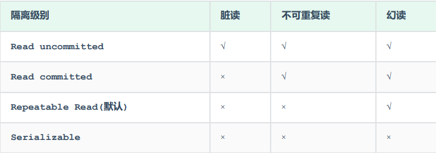

# 事务

## 事务的四大特性

> - 原子性（Atomicity）：事务是不可分割的最小操作单元，要么全部成功，要么全部失败。
> - 一致性（Consistency）：事务完成时，必须使所有的数据都保持一致状态。
> - 隔离性（Isolation）：数据库系统提供的隔离机制，保证事务在不受外部并发操作影响的独立环境下运行。
> - 持久性（Durability）：事务一旦提交或回滚，它对数据库中的数据的改变就是永久的。

---

## 事务操作

### 查看事务提交方式

> - ***select @@autocommit;***
> - `1` 是自动提交，`0` 是手动提交。

### 设置事务提交方式

> - ***set @@autocommit = 0;***

### 开启事务

> - ***start transaction;*** or ***begin;***

### 提交事务

> - ***commit;***

### 回滚事务

> - ***rollback;***

---

## 并发事务问题

> - 脏读：一个事务读到另外一个事务还没有提交的数据。事务A对id为1的数据进行了修改，但还没有提交，但此时事务B读取的id为1的数据是事务A修改后的，这就是脏读。
> - 不可重复读：一个事务先后读取同一条记录，但两次读取的数据不同。事务A先对id为1的数据进行了查询，然后紧接着事务B对id为1的数据进行了修改并提交，接着事务A对id为1的数据又进行了查询，发现和上次查询的结果不一样，这就是不可重复读。
> - 幻读：一个事务按照条件查询数据时，没有对应的数据行，但是在插入数据时，又发现这行数据已经存在。在假设解决了不可重复读的情况下，事务A中查询发现没有id为1的数据，紧接着事务B插入了id为1的数据并提交，事务A本来打算插入id为1的数据，但它发现这条数据无法插入，可它再次查询id为1的数据，返回的结果表示没有这条数据（解决了不可重复读），这就是幻读。

---

## 事务隔离级别

> 

### 查询事务的隔离级别

> - ***select @@transaction__isolation;***

### 设置事务的隔离级别

> - ***set {session | global} transaction isolation level {read uncommitted | read committed | repeatable read | serializable};***
> - 事务隔离级别越高，数据越安全，但操作性能越低。

---
---
