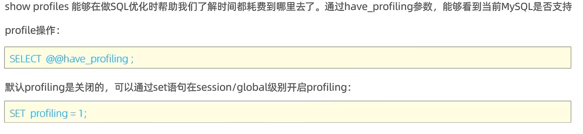

# 索引

> - ***索引是帮助MySQL高效获取数据的数据结构。在数据之外，数据库系统还维护着满足特定查找算法的数据结构，这些数据结构以某种方式引用或指向数据，这样就可以在这些数据结构上实现高级查找算法，这种数据结构就是索引。MySQL的索引是在存储引擎层实现的，不同的存储引擎有不同的索引结构。***

---

## 索引的特点

> 

---

## 索引的结构

### 索引结构的分类

> 

### 不同存储引擎对索引结构的支持

> 

### B+树结构

> 

### 哈希索引

> - 哈希索引就是采用一定的哈希算法，将键值换算成新的哈希值，映射到对应的槽位上，然后存储在哈希表中，如果键名对应的哈希值相同，就形成一条链表挂起来。
> - 哈希索引只能用于对等比较，不支持范围查询，它无法利用索引完成排序操作，但查询效率高，通常在不存在哈希冲突的情况下只需要一次检索就可以了，效率通常要高于B+树索引。
> - 在MySQL中，支持哈希索引的是Memory存储引擎。而InnoDB中具有自适应哈希功能，哈希索引是InnoDB存储引擎根据B+树索引在指定条件下自动构建的。

### 为什么InnoDB存储引擎选择使用B+树索引结构

> - 相对于二叉树，层级更少，搜索效率高。
> - 对于B树，无论是叶子节点还是非叶子节点，都会保存数据，这样导致一页中存储的键值减少，指针跟着减少，要同样保存大量数据，只能增加树的高度，导致性能降低。而B+树所有的数据都会出现在叶子节点，叶子节点形成一个单向链表，非叶子节点仅仅起到索引数据作用，具体的数据都是在叶子节点存放的。而且MySQL索引数据结构对经典的B+树进行了优化。在原B+树的基础上，增加一个指向相邻叶子节点的链表指针，就形成了带有顺序指针的B+树，提高区间访问的性能，利于排序。
> - 相对Hash索引，B+树支持范围匹配及排序操作。

---

## 索引分类

### MySQL数据库中索引的具体类型

> 

### InnoDB存储引擎中按存储形式对索引的分类

> 

### 聚集索引与二级索引的结构

> 

### 回表查询

> - 先到二级索引中查找数据，找到主键值，然后再到聚集索引中根据主键值，获取行数据的方式，称为回表查询，所以按照主键进行查询的效率比按照普通字段查询的效率要高。
> 

---

## 索引语法

### 创建索引

> - ***create [unique|fulltext] index 索引名 on 表名(字段1, 字段2, ...);***
> - 索引关联一个字段叫单列索引，关联多个字段叫联合或组合索引。

### 查看索引

> - ***show index from 表名;***

### 删除索引

> - ***drop index 索引名 on 表名;***

---

## SQL性能分析

### 查看数据库增删改查的频次

> - ***show [session|global] status like 'Com_______';***
> - 7个下划线。
> - `session` 是当前会话而 `global` 是全局会话。
> - 结果中 `Com_delete` 是删除次数， `Com_insert` 是插入次数， `Com_select` 是查询次数， `Com_update` 是更新次数。

### 查看慢查询日志

> - 查看慢查询日志有没有打开：***show variables likes like 'slow_query_time';***
> - 

### 查看profile

> 
> 

### 查看explain执行计划

> 
> 
> 

---

## 索引使用规则

### 最左前缀法则

> - 在使用联合索引时，查询的字段应该包含索引中的最左列，并且不跳过中间的列。如果不包含索引的最左列，将不会使用索引，如果跳过了中间的列，只有跳过前左边的列会使用索引，跳过后面的不用。

### 范围查询限制

> - 在使用联合索引时，如果出现范围查询大于和小于（不包括大于等于、小于等于和等于），范围查询列右侧（索引中的右侧）的列索引失效。

### 运算限制

> - 查询时不要在索引列上进行运算（如字符串的裁剪），否则索引将失效。

### 字符串引号限制

> - 当字符串类型字段作为索引列进行查询时，不加引号索引将失效。

### 模糊查询限制

> - 如果仅仅是尾部模糊匹配，索引不会失效。如果是头部模糊匹配，索引失效。

### or连接条件限制

> - 用or分割开的条件，如果or前的条件中的列有索引，而后面的列中没有索引，那么涉及的索引都不会被用到，当or连接的条件，左右两侧字段都有索引时，索引才会生效。

### 数据分布限制

> - MySQL在查询时，会评估使用索引的效率与走全表扫描的效率，如果走全表扫描更快，则放弃索引，走全表扫描。因为索引是用来索引少量数据的，如果通过索引查询返回大批量的数据，则还不如走全表扫描来的快，此时索引就会失效。

### 使用覆盖索引

> - 查询返回的列中，都应该创建的索引，首先主键既可以通过二级索引的挂载查到，也可以通过主键索引查到，二级索引在使用时在B+树上查到的叶子节点也是自己这一列的数据。但还要返回没有建立索引的字段，还需要进行回表查询，从主键的聚集索引中拿到行数据。

### 为字符串类型创建前缀索引

> - ***create [unique|fulltext] index 索引名 on 表名(column(字段名));***
> - 当字段类型为字符串时，有时候需要索引很长的字符串，这会让索引变得很大，查询时，浪费大量的磁盘IO， 影响查询效率。此时可以只将字符串的一部分前缀，建立索引，这样可以大大节约索引空间，从而提高索引效率。
> 前缀长度可以根据索引的选择性来决定，而选择性是指不重复的索引值和数据表的记录总数的比值，索引选择性越高则查询效率越高，唯一索引的选择性是1，这是最好的索引选择性，性能也是最好的。

---

## SQL提示

### 建议MySQL使用哪一个索引完成此次查询

> - ***select 字段列表 from 表名 use index (索引名) 条件语句;***

### 忽略指定的索引

> - ***select 字段列表 from 表名 ignore index (索引名) 条件语句;***

### 强制使用索引

> - ***select 字段列表 from 表名 force index (索引名) 条件语句;***

---

## 索引设计原则

> - 针对于数据量较大，且查询比较频繁的表建立索引。
> - 针对于常作为查询条件、排序、分组操作的字段建立索引。
> - 尽量选择区分度高的列作为索引，尽量建立唯一索引，区分度越高，使用索引的效率越高。
> - 如果是字符串类型的字段，字段的长度较长，可以针对于字段的特点，建立前缀索引。
> - 尽量使用联合索引，减少单列索引，查询时，联合索引很多时候可以覆盖索引，节省存储空间，避免回表，提高查询效率。
> - 要控制索引的数量，索引并不是多多益善，索引越多，维护索引结构的代价也就越大，会影响增删改的效率。
> - 如果索引列不能存储NULL值，请在创建表时使用NOT NULL约束它。当优化器知道每列是否包含
NULL值时，它可以更好地确定哪个索引最有效地用于查询。

---
---
